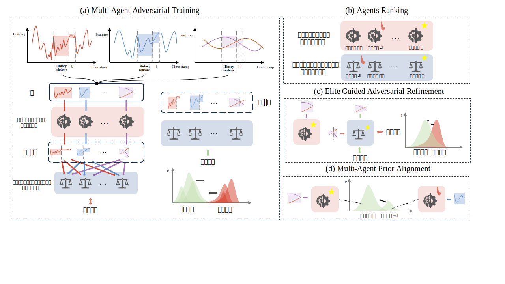

# MAA
<p>Code base of 
    <span style="color:#2E8B57;">M</span>ulti- 
    <span style="color:#1E90FF;">A</span>gent 
    <span style="color:#8B0000;">A</span>dversarial
    <span style="color:#FF8C00;">T</span>ime 
    <span style="color:#FFD700;">S</span>eries
    <span style="color:#800080;">F</span>orecasting
    (MAA-TSF)
</p>

---

## Overall paradigm


## Brief Intro

A multi-period group crossover and multi-factor pheromone transmission mechanism, grounded in the MAA framework, empowers individual agents to selectively attend to salient local signals, thereby enhancing their representational capacity, while simultaneously enabling adaptive and efficient collaborative modeling across agents.

### A class inherit structure:

```
MAAbase
 | 
 | -- MAA time series
 | -- MAA {image} generation 
 | -- ... {more other generation tasks}
```

### Initialize models: 
- N generators, e.g. [GRU, LSTM, Transformer]  # 3 generator models
- N discriminators, e.g. [CNND1, CNND2, CNND3]  # 3 discriminator models
- Generators use past window size to predict next 1 (to N maybe will realize in the future version) timestamp.
- Discriminators use past window size concatting predict label to discriminate and adversarial train

```
MAATSF/
├── models/
│   ├── __init__.py
│   ├── model.py                  # Baseline model
│   ├── model_with_clsHead.py     # G with classification head
│   └── model_with_clsdisc.py     # G&D with classification head
```

### Main loop: 
Now following are the present code logic. (Please point out if there exists any faults)
``` 
FOR e in EPOCHS: 
  # Main training loop
  # 1. Individual pre-training
  for generator in generators:
      train(generator, loss_fn=MSE, Cross Entropy)  # Train each generator separately with MSE loss
      
  for discriminator in discriminators:
      train(discriminator, loss_fn=ClassificationLoss)  # Train each discriminator with classification loss (0: no change, 1: up, -1: down)

  while e % k ==0: 
    # 2. Intra-group evaluation and selection
    best_generator = evaluate_and_select_best(generators, validation_data)
    best_discriminator = evaluate_and_select_best(discriminators, validation_data)
      
    # 3. Intra-group knowledge distillation
    distill(best_generator, worst_generator)
     
    # 4. Cross-group competition
    FOR e0 in k0: 
      adversarial_train(best_generator, best_discriminator)
      if not converge: 
        break
```

---

# Scripts

```
MAATSF/
├── sh/                           # Shell scripts for automation
│   ├── __init__.py
│   ├── check_order.sh            # Validate dataset order
│   ├── process_raw_files.sh      # Script for processing raw files
│   ├── run_all_erm.sh            # Run ERM (non-adversarial) experiments
│   ├── run_all_gan.sh            # Run single adversarial experiments
│   └── run_all_maa.sh            # Run MAA
```

# Code Execution Guide

This guide will walk you through setting up the environment, preparing the dataset, and running our Python code and scripts.

## 1. Environment Setup

```bash
pip install -r requirements.txt
```

## 2. Dataset Preparation

Sample processed dataset file from the following links:

* [Google Drive](https://drive.google.com/drive/folders/1-Nr35rIcindBcCdlQJsoyaOUfOZQacx8?usp=sharing)
* [Baidu Cloud](https://pan.baidu.com/s/1qhd4Vw0aJ37ETxD4PkA4pQ?pwd=38tv)

```
├── database/
│   ├── data_process.py           # Raw data preprocessing script
│   ├── preprocessed/
│   │   └── kline_processed_data/ # Daily K-line datasets for multiple assets
│   └── raw/                      # Raw data (not committed to Git)
```

run **process_raw_files.sh** to process all raw files from raw directory

## 3. Running the Code

You can run the code using the following two methods:

### Method 1: Running the `run_all_*.sh` Script (Recommended for Batch Experiments)

If you need to run a series of predefined experiments, you can directly execute the `run_all_*.sh` script. These scripts will run experiments in batches according to the parameters defined within it.

In your terminal, navigate to your project directory and execute:

```bash
chmod +x run_all.sh # If the script doesn't have execute permission, add it first
bash ./sh/run_all_*.sh
```

Please ensure that the `DATA_FILE` and `OUTPUT_DIR` variables set within the `run_all.sh` script point to the correct data path and output results path.

### Method 2: Running `run_multi_gan.py` Directly

If you only need to run a single experiment or for debugging purposes, you can run `run_multi_gan.py` directly and specify configurations via command-line arguments.

Here is an example command to run `run_multi_gan.py` directly:

```bash
python run_multi_gan.py \
    --data_path "$FILE" \
    --output_dir "$OUTPUT_DIR" \
    --feature_columns 1 19 1 19 1 19\
    --start_timestamp "$START_TIMESTAMP"\
    --end_timestamp "$END_TIMESTAMP" \
    --N_pairs 3 \
    --distill_epochs 1 \
    --cross_finetune_epochs 5 \
    --num_epochs 1024
```

Please replace the placeholder variables in the command, details of arguements can be found in `run_multi_gan.py`

You can modify the values of these parameters according to your experiment requirements.

## 4.Supplementary Notes for developer

```
MAATSF/
├── trainer/
│   ├── baseframe_trainer.py      # Base training class
│   ├── multiGAN_trainer.py       # MAA training for regression 
│   └── multiGAN_trainer_disccls.py # MAA training for regression 
&classification
└── utils/
    ├── __init__.py
    ├── evaluate_visualization.py # Visualization for model evaluation
    ├── logger.py                 # Logging setup
    └── util.py                   # General-purpose utilities
├── MAA_base.py                   # Base class for multi-asset learning
├── requirements.txt              # Python dependency list
├── run_multi_gan.py              # Main script to run multi-GAN training
├── time_series_maa.py            # Entry point for time series modeling
```


---